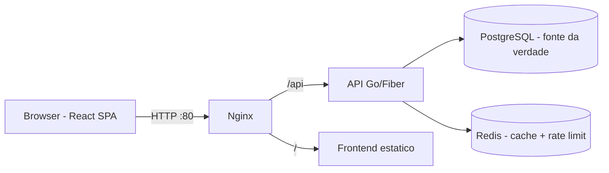

# Documentação

Documentação técnica do sistema de autenticação e autorização. A especificação original está em [../plano.md](../plano.md); as convenções de código em [../AGENTS.md](../AGENTS.md).

| Documento | O que cobre |
|---|---|
| [backend.md](backend.md) | Arquitetura em camadas, fluxos de login/refresh/autorização, tokens, rotas, jobs de background, testes |
| [database.md](database.md) | Schema completo (diagrama ER), tabelas, índices, migrations, ciclo de vida das sessões, auditoria |
| [redis.md](redis.md) | Chaves e tipos de dado, cache-aside de permissões, rate limit de login, comportamento em falha |
| [frontend.md](frontend.md) | Estrutura da SPA, gestão de tokens (memória + cookie), renovação automática, controle visual de permissões |
| [infra.md](infra.md) | Docker Compose, Nginx, portas, healthchecks, variáveis de ambiente, operação |

## Visão geral em 30 segundos

- **Autenticação**: JWT de 15 min (memória do frontend) + refresh token de 30 dias (cookie HttpOnly, rotacionado a cada uso, só o hash no banco)
- **Autorização**: permissões granulares por usuário (`users.manage`, `clients.read`...), verificadas no backend a cada request, com cache Redis de 5 min
- **Roles** são só classificação organizacional — não concedem permissões
- **Auditoria**: toda ação crítica registrada em `audit_logs` (JSONB, permanente)
