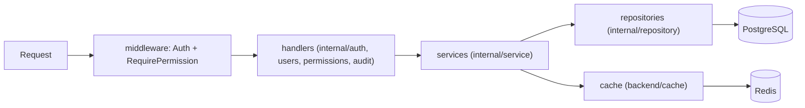
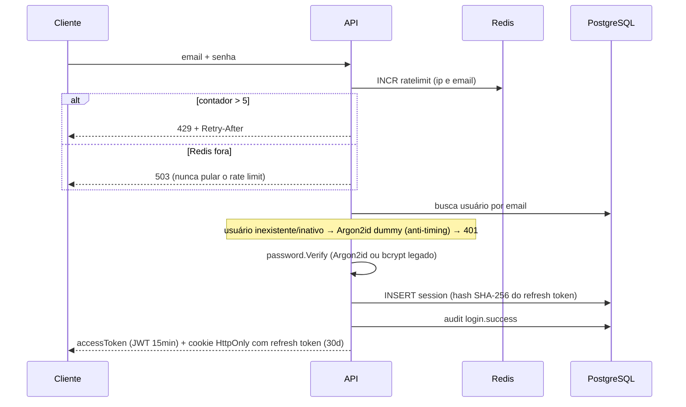

# Backend

API em **Go + Fiber**, com Bun (ORM), go-redis, golang-migrate, JWT RS256 e Argon2id (bcrypt legado migrado no login).

## Arquitetura em camadas

Fluxo obrigatório: `handler → service → repository`. Nenhuma camada pula a seguinte.



| Camada | Responsabilidade | O que é proibido |
|---|---|---|
| `middleware/` | Validar JWT, verificar usuário ativo, checar permissão | Regra de negócio |
| handlers | Parse/validação de input, mapear erro → status HTTP | SQL, regra de negócio |
| `internal/service/` | Regras de negócio, auditoria, orquestração de cache | Tocar HTTP (`fiber.Error`) |
| `internal/repository/` | Todas as queries (única camada que vê `bun.DB`) | Lógica de negócio |

A montagem (wiring) fica em `internal/app/app.go` — usada pelo `main` e pelos testes e2e. O `cmd/api/main.go` só lê env vars e dá boot.

### Tratamento de erros

- Services retornam **erros sentinela** (`ErrInvalidCredentials`, `ErrEmailTaken`, `ErrCannotDeactivateSelf`...); repositories convertem `sql.ErrNoRows` em `repository.ErrNotFound`
- Handlers traduzem com `errors.Is` para `fiber.NewError(status, msg)`
- O que não for mapeado cai no **ErrorHandler global**: responde `500` genérico e loga o erro real — detalhes internos nunca vazam na resposta

## Fluxo de autenticação

### Login (`POST /auth/login`)



### Refresh com rotação (`POST /auth/refresh`)

1. Lê o refresh token do cookie e busca a sessão pelo SHA-256 (não revogada, não expirada)
2. Verifica que o usuário segue ativo
3. **Rotaciona**: gera token novo, substitui o hash na mesma sessão — o token anterior morre imediatamente
4. Emite novo access token

### Tokens

| | Access | Refresh |
|---|---|---|
| Formato | JWT RS256 (`sub`, `sid`, `email`, `iat`, `exp`) | 32 bytes aleatórios, base64url |
| Validade | 15 min | 30 dias (renovado a cada rotação) |
| Armazenamento | Memória do frontend | Cookie `HttpOnly` `SameSite=Strict`; só o hash SHA-256 no banco |
| Permissões dentro? | **Nunca** | — |

## Autorização

```go
app.Get("/users", authMW, requirePerm("users.manage"), handler.List)
```

- `Auth`: valida assinatura/expiração do JWT, confirma usuário **ativo** no banco (token de usuário desativado morre na hora), injeta `userId` no contexto
- `RequirePermission(code)`: cache-aside no Redis com fallback Postgres (detalhes em [redis.md](redis.md)) → `403` se não possuir

## Rotas

| Método | Rota | Proteção |
|---|---|---|
| POST | `/auth/login`, `/auth/refresh`, `/auth/logout` | Públicas (login com rate limit) |
| GET | `/health` | Pública — verifica Postgres + Redis |
| GET | `/me` | Autenticado |
| GET/POST | `/users` · GET/PATCH `/users/:id` | `users.manage` |
| GET | `/permissions` | `permissions.manage` |
| POST/DELETE | `/users/:id/permissions[/:permissionId]` | `permissions.manage` |
| GET | `/audit-logs` | `audit_logs.read` |

Regras de negócio notáveis: email validado com `net/mail`; senha mínima de 8 chars; usuário **não pode desativar a própria conta** (`409`); desativação revoga todas as sessões e invalida o cache de permissões.

## Background e ciclo de vida

- **Limpeza de sessões**: goroutine a cada 1h deleta sessões expiradas/revogadas há mais de 7 dias
- **Graceful shutdown**: SIGINT/SIGTERM → `ShutdownWithTimeout(10s)` → fecha conexões
- **Seed do admin**: no startup, se `users` está vazia, cria o admin (`ADMIN_EMAIL`/`ADMIN_PASSWORD`) com todas as permissões
- **Logs**: `log/slog` estruturado em JSON (`slog.Error("msg", "userId", id, "error", err)`)

## Testes

Suite ponta a ponta em `backend/tests/`: app real via `app.New` + `Fiber.Test()`, Postgres (banco `auth_test` recriado por execução) e Redis (db 1) reais. Cobre login, rotação de refresh (nova sessão + detecção de reuse), fingerprint de sessão, logout, rate limit escalonado, wildcards de permissão, JWT RS256, `security.alert`, viagem impossível (GeoIP mock), migração Argon2id, 401/403, grant/revoke, desativação e auditoria expandida.

```bash
cd infra && docker compose up -d postgres redis
cd backend && go test ./tests/ -v
```

## Qualidade

```bash
go build ./... && go vet ./...
golangci-lint run ./...     # config em .golangci.yml (regra exported do revive desabilitada de propósito)
```
