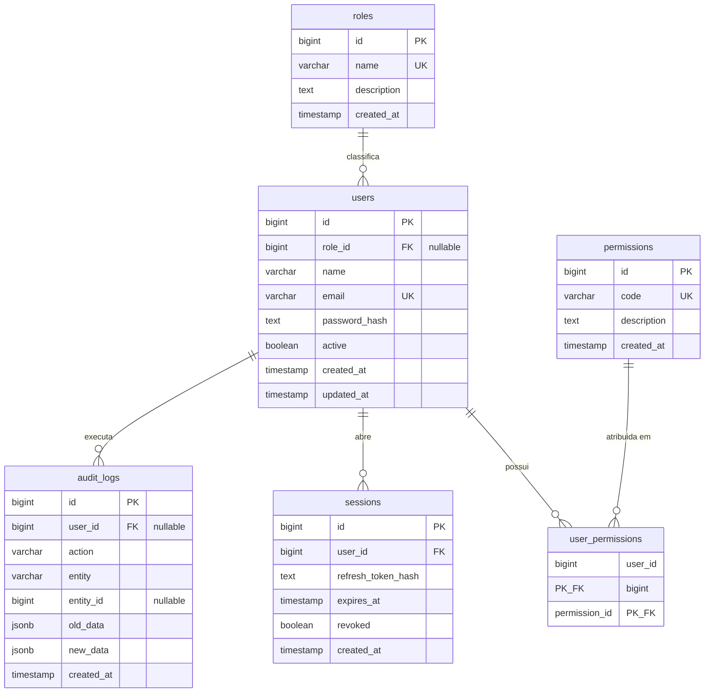

# Banco de Dados (PostgreSQL)

PostgreSQL 16 é a **fonte da verdade** de todos os dados persistentes: usuários, permissões, sessões e auditoria. O Redis nunca substitui o Postgres — apenas cacheia (ver [redis.md](redis.md)).

## Diagrama de entidades



## Tabelas

### `roles` — classificação organizacional

Roles **não concedem permissões**. Servem apenas para organização, relatórios e regras de negócio específicas. Seed inicial: `Admin`, `Supervisor`, `Operador`, `Financeiro`, `Vendedor`.

### `users`

| Coluna | Tipo | Observação |
|---|---|---|
| `id` | BIGINT IDENTITY | PK |
| `role_id` | BIGINT | FK opcional para `roles` (nullable) |
| `email` | VARCHAR(255) | UNIQUE — usado no login |
| `password_hash` | TEXT | **Sempre bcrypt** (cost padrão 10). Nunca texto puro/MD5/SHA1 |
| `active` | BOOLEAN | `false` = bloqueado: login negado, access tokens param de valer (middleware verifica a cada request), sessões revogadas |

### `permissions` — o que o usuário pode fazer

Permissões são atribuídas **diretamente ao usuário** (não via role). Formato do code: `recurso.acao`. Seed atual (3 — só as com rotas implementadas):

```
users.manage    permissions.manage    audit_logs.read
```

### `user_permissions` — junção N:N

PK composta `(user_id, permission_id)`, com `ON DELETE CASCADE` nos dois lados. Grant usa `ON CONFLICT DO NOTHING` (idempotente).

### `sessions` — refresh tokens

| Coluna | Observação |
|---|---|
| `refresh_token_hash` | **SHA-256 em hex do token** — o token puro nunca é armazenado. SHA-256 (e não bcrypt) porque o lookup é feito pelo hash; a entropia do token (256 bits aleatórios) dispensa salt |
| `expires_at` | 30 dias a partir da emissão; renovado a cada rotação |
| `revoked` | `true` no logout ou na desativação do usuário |

Ciclo de vida: criada no login → hash substituído a cada refresh (rotação) → revogada no logout → **deletada** pelo job de limpeza quando expirada/revogada há mais de 7 dias (roda a cada 1h, ver `runSessionCleanup` em `backend/internal/app/app.go`).

### `audit_logs` — trilha de auditoria

Toda ação crítica gera um registro: `login.success`, `login.failed` (com `reason`: `wrong_password`, `user_not_found`, `user_inactive`, `rate_limited`), `logout`, `user.created`, `user.updated`, `permission.granted`, `permission.revoked`.

- `user_id` é nullable: tentativas de login falhas não têm usuário autenticado
- `old_data`/`new_data` são JSONB com o estado antes/depois da mutação
- A escrita usa `context.WithoutCancel` — é gravada mesmo se o cliente desconectar
- Nunca é deletada (histórico permanente)

## Índices

```sql
CREATE INDEX idx_users_email ON users(email);
CREATE INDEX idx_users_role_id ON users(role_id);
CREATE INDEX idx_sessions_user_id ON sessions(user_id);
CREATE INDEX idx_sessions_expires_at ON sessions(expires_at) WHERE revoked = FALSE;  -- parcial: só sessões ativas
CREATE INDEX idx_audit_logs_user_id ON audit_logs(user_id);
CREATE INDEX idx_audit_logs_entity ON audit_logs(entity, entity_id);
CREATE INDEX idx_audit_logs_created_at ON audit_logs(created_at);
```

## Migrations

Gerenciadas por **golang-migrate**, aplicadas automaticamente no startup da API (`database.RunMigrations`). Nunca usamos AutoMigrate.

```
backend/migrations/
├── 000001_init.up.sql      # schema completo + índices
├── 000001_init.down.sql
├── 000002_seed.up.sql      # roles e permissions iniciais
└── 000002_seed.down.sql
```

Regras:
- Mudança de schema = **migration nova** (nunca editar uma já aplicada)
- Após migration, atualizar a struct Bun correspondente em `backend/internal/models/models.go`
- A tabela `schema_migrations` (criada pelo golang-migrate) controla a versão aplicada

O **usuário admin** não está em migration: é criado no startup (`SeedAdmin`) apenas se a tabela `users` estiver vazia, com email/senha de `ADMIN_EMAIL`/`ADMIN_PASSWORD` e todas as permissões — evita hash bcrypt hardcoded em SQL.

## Acesso

- ORM: **Bun** (SQL-first). Structs em `internal/models/`, queries em `internal/repository/` — única camada que toca o `bun.DB`
- Todas as queries são parametrizadas (`Where("email = ?", email)`) — proteção contra SQL injection
- Pool: 25 conexões máx, 25 idle, lifetime 30min (`database.Connect`)

## Conexões

| Contexto | Endereço |
|---|---|
| API dentro do Docker | `postgres:5432` |
| Host (ferramentas, testes) | `127.0.0.1:55432` — porta 55432 para não conflitar com Postgres nativo do Windows |
| Testes e2e | banco `auth_test`, recriado a cada execução da suite |
