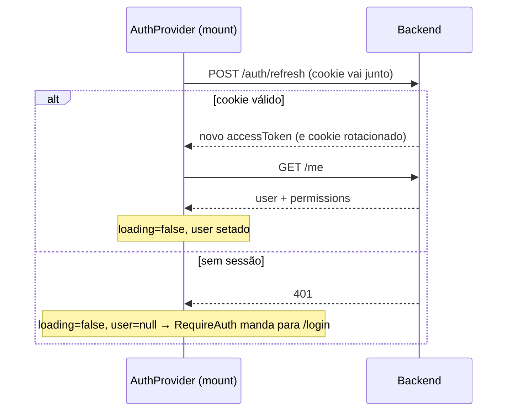

# Frontend

SPA em **React 19 + Vite + TypeScript**, com Tailwind CSS 4, React Router 7 e TanStack Query. Servida em produção como build estática por um Nginx próprio (container `frontend`), atrás do Nginx principal.

**Princípio central**: o frontend é não-confiável por definição. Todo controle de permissão aqui é **cosmético** (esconder UI) — a autorização real acontece sempre no backend.

## Estrutura — convenção App Router

As rotas seguem a convenção do Next.js App Router (pastas `app/`, arquivos `layout.tsx`/`page.tsx`, route groups entre parênteses), montadas explicitamente no React Router em `router/index.tsx` — sem gerador automático.

```
frontend/src/
├── main.tsx                    # bootstrap: providers + <AppRouter />
├── router/
│   ├── index.tsx               # monta <Routes> com layouts aninhados + lazy()
│   └── paths.ts                # fonte única de paths: paths.users(), paths.audit()...
├── app/
│   ├── layout.tsx              # RootLayout (ponto para error boundary futuro)
│   ├── (public)/               # route group — NÃO entra na URL
│   │   ├── layout.tsx          # PublicLayout: conteúdo centralizado
│   │   └── login/page.tsx      # /login
│   └── (protected)/
│       ├── layout.tsx          # ProtectedLayout: RequireAuth + AppShell + Suspense
│       ├── page.tsx            # / (Dashboard)
│       ├── users/page.tsx      # /users        (users.manage, lazy)
│       ├── permissions/page.tsx# /permissions  (permissions.manage, lazy)
│       ├── audit/page.tsx      # /audit        (audit_logs.read, lazy)
│       └── sessions/page.tsx   # /sessions     (Gerenciamento de sessões)
├── services/
│   └── api.ts                  # ÚNICO ponto de fetch + api.users/permissions/audit/sessions
├── providers/
│   └── AuthProvider.tsx        # contexto: user, permissions, login(), logout()
├── hooks/
│   └── usePermission.ts
└── components/
    ├── AppShell.tsx            # header + nav (links visíveis via Can)
    ├── RequireAuth.tsx         # guard de autenticação
    ├── RequirePermission.tsx   # guard de rota por permissão (Outlet)
    └── Can.tsx                 # esconde pedaços de UI
```

### Mapa de rotas

| Rota | Arquivo | Guard | Descrição |
|---|---|---|---|
| `/login` | `app/(public)/login/page.tsx` | Pública; redireciona para `/` se logado | Tela de login |
| `/` | `app/(protected)/page.tsx` | `RequireAuth` | Dashboard principal |
| `/sessions` | `app/(protected)/sessions/page.tsx` | `RequireAuth` | Gerenciamento de dispositivos/sessões ativas |
| `/users` | `app/(protected)/users/page.tsx` | `RequireAuth` + `users.manage` | Controle de usuários |
| `/permissions` | `app/(protected)/permissions/page.tsx` | `RequireAuth` + `permissions.manage` | Gestão de perfis e permissões |
| `/audit` | `app/(protected)/audit/page.tsx` | `RequireAuth` + `audit_logs.read` | Visualização de logs de auditoria |
| `*` | `NotFoundPage` em `router/index.tsx` | — | Fallback 404 |

### Convenções de rota

- **Nova página**: criar `app/(protected)/<segmento>/page.tsx` (export default) e registrar em `router/index.tsx` dentro do guard adequado
- **Links**: sempre via `paths.x()` — nunca strings soltas
- **Guard duplo**: rota inteira protegida por `RequirePermission` (redireciona) **e** link/cards escondidos por `Can` (cosmético). O backend continua sendo a autorização real
- **Páginas admin são lazy**: `lazy(() => import(...))` em `router/index.tsx`; o `Suspense` fica no `ProtectedLayout`

## Gestão de tokens — a parte mais importante

| Token | Onde vive | Duração | Quem gerencia |
|---|---|---|---|
| Access token (JWT) | **Memória JS** (variável de módulo em `api.ts`) | 15 min | Código da aplicação |
| Refresh token | Cookie `HttpOnly` + `SameSite=Strict` | 30 dias | Browser (JS não consegue ler) |

O access token **nunca** toca `localStorage`/`sessionStorage` — um XSS não consegue exfiltrá-lo de lá. Custo do trade-off: F5 perde o token da memória, por isso existe a restauração de sessão (abaixo).

## Fluxos

### Restauração de sessão (page load / F5)



### Renovação automática em 401 (`api.ts`)

Toda chamada passa por `request()`. Se a resposta for `401`, ele tenta **uma vez** o refresh e repete a chamada original:

```ts
let res = await rawRequest(path, options);
if (res.status === 401 && (await tryRefresh())) {
  res = await rawRequest(path, options); // repete com o token novo
}
```

Na prática: o access token expira a cada 15 min e o usuário nunca percebe. Se o refresh também falhar (sessão revogada/expirada), o erro sobe e o usuário cai no login.

### Login e logout

- `login()`: `POST /auth/login` → guarda `accessToken` em memória → `GET /me` popula user + permissions no contexto
- `logout()`: `POST /auth/logout` (revoga a sessão no banco e limpa o cookie) → zera token, user e permissions localmente — mesmo se a chamada falhar (bloco `finally`)

## Controle visual de permissões

O `/me` retorna os codes do usuário (ex.: `["users.manage", "audit_logs.read"]`), guardados no `AuthProvider`. Dois jeitos de usar:

```tsx
// Declarativo — esconde o card se não tiver a permissão
<Can permission="users.manage">
  <CardUsuarios />
</Can>

// Imperativo — para lógica
const podeVerAuditoria = usePermission("audit_logs.read");
```

Lembrete: isso só esconde pixels. Se o usuário forjar a chamada, o backend responde `403`.

## Comunicação com a API

- Base URL: **`/api`** — mesmo path em dev e produção:
  - **Dev** (`npm run dev`): proxy do Vite reescreve `/api/*` → `http://localhost:8080/*` (config em `vite.config.ts`)
  - **Produção**: Nginx principal roteia `/api/*` → container da API
- `credentials: "include"` em todas as chamadas (o cookie de refresh precisa viajar)
- Erros viram `ApiError { status, message }` — as páginas tratam status específicos (401 → "credenciais incorretas", 429 → "muitas tentativas")

## Build e qualidade

```bash
npm run dev           # dev server com HMR (porta 5173)
npm run build         # tsc --noEmit + vite build → dist/
npm run lint          # ESLint (flat config: typescript-eslint + react-hooks)
npm run format        # Prettier em src/
```

Convenções: componentes funcionais, hooks para lógica reutilizável, Tailwind para estilo (sem CSS separado além do `index.css` com o import do Tailwind), mensagens de UI em português.

## Telas admin

As páginas `/users`, `/permissions` e `/audit` usam TanStack Query (`useQuery`/`useMutation`) sobre os métodos de `api.ts`:

- **`/permissions`**: seleção de usuário + grant/revoke por permissão; mutações invalidam a query `["users"]` para refletir o estado real do backend
- **`/users`**: tabela com nome, email, role, contagem de permissões e status (`api.users.list()`). Permite a criação e edição de usuários via modal interativo, com validação de senha integrada.
- **`/audit`**: tabela paginada (`limit`/`offset`) via `api.audit.list()`

## Sistema de Design (Glassmorphism & Sidebar Colapsável)

O frontend foi redesenhado com uma identidade moderna e fluida:
- **Tema Visual**: Estética glassmorphism com fundos translúcidos (`backdrop-blur-md`), bordas semitransparentes e gradientes suaves.
- **Modos Claro e Escuro**: Gerenciado via classe `.light` no elemento raiz (`<html>`) com alternância manual no painel de usuário da sidebar.
- **Contraste de Permissões**: A classe `.code-pill` garante visualização clara em ambos os modos (incluindo cores escuras/pretas no modo claro).
- **Sidebar Colapsável**:
  - Controlada por estado reativo (`isCollapsed`) no `AppShell.tsx`.
  - Botão interno para recolher (ícone de painel) encolhe a sidebar para `w-0` (com transição CSS suave).
  - Botão flutuante redondo suspenso à esquerda (`fixed left-3`) reabre a sidebar.

## Limitações atuais (conscientes)

- O fluxo de auth usa estado manual no `AuthProvider` (não TanStack Query) — decisão consciente: sessão é estado global síncrono, não cache de servidor
- Não há testes de frontend (a cobertura e2e está no backend, ver `backend/tests/`)
