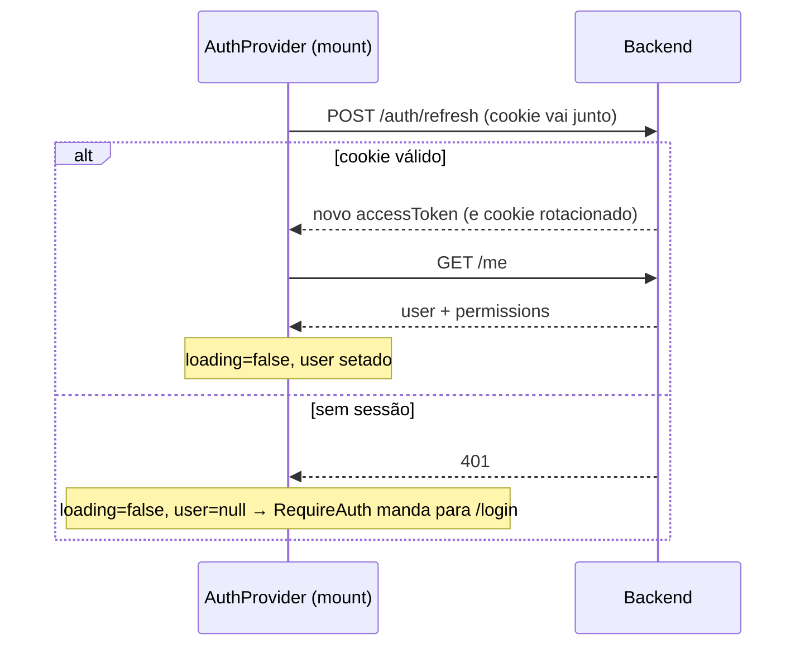

# Frontend

SPA em **React 19 + Vite + TypeScript**, com Tailwind CSS 4, React Router 7 e TanStack Query. Servida em produção como build estática por um Nginx próprio (container `frontend`), atrás do Nginx principal.

**Princípio central**: o frontend é não-confiável por definição. Todo controle de permissão aqui é **cosmético** (esconder UI) — a autorização real acontece sempre no backend.

## Estrutura

```
frontend/src/
├── main.tsx                 # bootstrap: QueryClient → Router → AuthProvider → rotas
├── services/
│   └── api.ts               # ÚNICO ponto de fetch. Token em memória + retry em 401
├── providers/
│   └── AuthProvider.tsx     # contexto: user, permissions, login(), logout(), hasPermission()
├── hooks/
│   └── usePermission.ts     # açúcar sobre hasPermission
├── components/
│   ├── RequireAuth.tsx      # guard de rota: loading → spinner; sem user → /login
│   └── Can.tsx              # renderiza children só se o usuário tem a permissão
└── pages/
    ├── Login.tsx            # formulário com tratamento de 401/429
    └── Dashboard.tsx        # mostra permissões e cards condicionais (placeholders)
```

Rotas: `/login` (pública) e `/` (Dashboard, protegida por `RequireAuth`).

## Gestão de tokens — a parte mais importante

| Token | Onde vive | Duração | Quem gerencia |
|---|---|---|---|
| Access token (JWT) | **Memória JS** (variável de módulo em `api.ts`) | 15 min | Código da aplicação |
| Refresh token | Cookie `HttpOnly` + `SameSite=Strict` | 30 dias | Browser (JS não consegue ler) |

O access token **nunca** toca `localStorage`/`sessionStorage` — um XSS não consegue exfiltrá-lo de lá. Custo do trade-off: F5 perde o token da memória, por isso existe a restauração de sessão (abaixo).

## Fluxos

### Restauração de sessão (page load / F5)



### Renovação automática em 401 (`api.ts`)

Toda chamada passa por `request()`. Se a resposta for `401`, ele tenta **uma vez** o refresh e repete a chamada original:

```ts
let res = await rawRequest(path, options);
if (res.status === 401 && (await tryRefresh())) {
  res = await rawRequest(path, options); // repete com o token novo
}
```

Na prática: o access token expira a cada 15 min e o usuário nunca percebe. Se o refresh também falhar (sessão revogada/expirada), o erro sobe e o usuário cai no login.

### Login e logout

- `login()`: `POST /auth/login` → guarda `accessToken` em memória → `GET /me` popula user + permissions no contexto
- `logout()`: `POST /auth/logout` (revoga a sessão no banco e limpa o cookie) → zera token, user e permissions localmente — mesmo se a chamada falhar (bloco `finally`)

## Controle visual de permissões

O `/me` retorna os codes do usuário (ex.: `["users.manage", "clients.read"]`), guardados no `AuthProvider`. Dois jeitos de usar:

```tsx
// Declarativo — esconde o card se não tiver a permissão
<Can permission="users.manage">
  <CardUsuarios />
</Can>

// Imperativo — para lógica
const podeExportar = usePermission("financial.export");
```

Lembrete: isso só esconde pixels. Se o usuário forjar a chamada, o backend responde `403`.

## Comunicação com a API

- Base URL: **`/api`** — mesmo path em dev e produção:
  - **Dev** (`npm run dev`): proxy do Vite reescreve `/api/*` → `http://localhost:8080/*` (config em `vite.config.ts`)
  - **Produção**: Nginx principal roteia `/api/*` → container da API
- `credentials: "include"` em todas as chamadas (o cookie de refresh precisa viajar)
- Erros viram `ApiError { status, message }` — as páginas tratam status específicos (401 → "credenciais incorretas", 429 → "muitas tentativas")

## Build e qualidade

```bash
npm run dev           # dev server com HMR (porta 5173)
npm run build         # tsc --noEmit + vite build → dist/
npm run lint          # ESLint (flat config: typescript-eslint + react-hooks)
npm run format        # Prettier em src/
```

Convenções: componentes funcionais, hooks para lógica reutilizável, Tailwind para estilo (sem CSS separado além do `index.css` com o import do Tailwind), mensagens de UI em português.

## Limitações atuais (conscientes)

- Os cards do Dashboard (Usuários, Permissões, Auditoria) são **placeholders** — as telas de gestão não foram construídas; apenas a API existe
- TanStack Query está instalado e provê o `QueryClientProvider`, mas o fluxo de auth usa estado manual no provider; queries declarativas fazem sentido quando as telas de admin forem construídas
- Não há testes de frontend (a cobertura e2e está no backend, ver `backend/tests/`)
