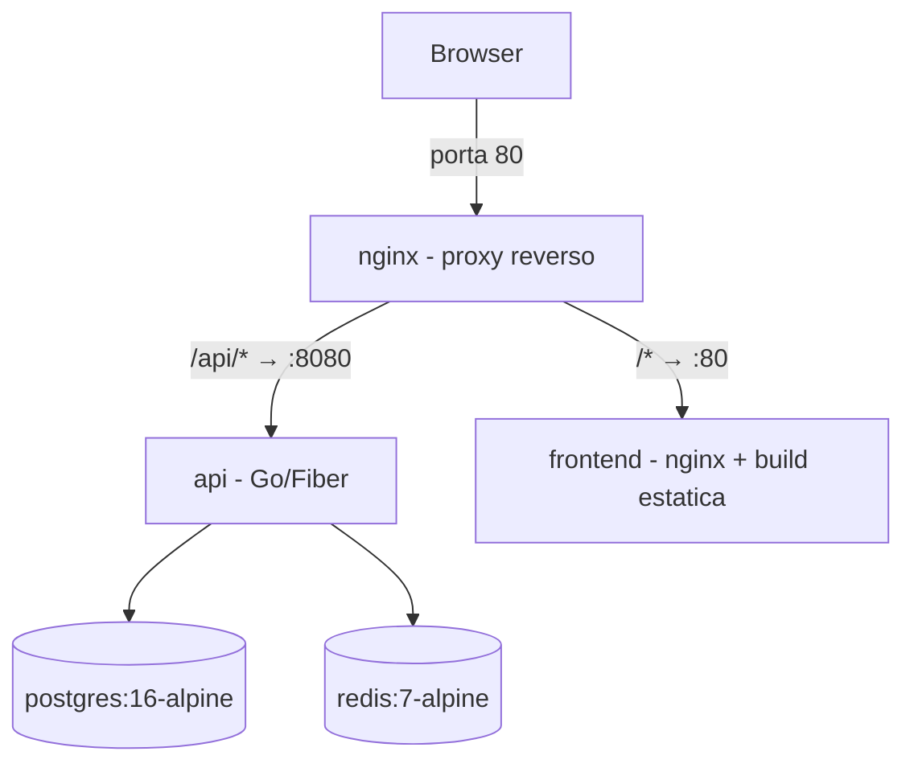

# Infraestrutura

Tudo orquestrado por Docker Compose em `infra/docker-compose.yml`. Cinco serviços:



## Serviços

| Serviço | Imagem | Porta no host | Healthcheck |
|---|---|---|---|
| `nginx` | nginx:1.27-alpine | **80** | — (depende de api healthy) |
| `frontend` | build de `frontend/Dockerfile` | — (interno) | — |
| `api` | build de `backend/Dockerfile` | — (interno :8080) | `wget /health` |
| `postgres` | postgres:16-alpine | **55432** | `pg_isready` |
| `redis` | redis:7-alpine (`--appendonly yes`) | **6379** | `redis-cli ping` |

**Por que 55432?** A porta 5432 do host conflitava com um PostgreSQL nativo do Windows nesta máquina. Dentro da rede Docker a API continua usando `postgres:5432`; a porta do host só importa para ferramentas e testes.

### Cadeia de dependências (healthchecks)

```
postgres healthy ──┐
                   ├──> api inicia ──> api healthy ──> nginx inicia
redis healthy ─────┘                   frontend started ─┘
```

A API se recusa a subir sem Postgres + Redis saudáveis, e o Nginx só sobe com a API healthy (sem isso o Nginx morre com "host not found in upstream"). O Nginx tem `restart: unless-stopped` como segunda linha de defesa.

## Nginx (proxy principal)

Config em `infra/nginx/nginx.conf`:

- `/api/*` → `http://api:8080/*` (o prefixo `/api` é removido no proxy_pass)
- `/*` → `http://frontend:80` (SPA; o nginx do frontend faz fallback para `index.html` — React Router)
- Repassa `X-Real-IP` / `X-Forwarded-For` (usados pelo rate limit de login)

**HTTPS**: o config atual escuta em HTTP puro — aceitável apenas em dev. Em produção: `listen 443 ssl` com certificados, redirect 80→443 e `COOKIE_SECURE=true` na API (sem isso o cookie de refresh viaja em claro).

## Imagens

### Backend (`backend/Dockerfile`)
- Multi-stage: `golang:1.26-alpine` (build, CGO desabilitado) → `alpine:3.21`
- Roda como usuário **não-root** (`app`, uid 10001)
- Inclui `migrations/` (aplicadas pela API no boot)

### Frontend (`frontend/Dockerfile`)
- Multi-stage: `node:22-alpine` (npm install + build) → `nginx:1.27-alpine` servindo `dist/`
- `nginx.conf` próprio com `try_files ... /index.html` para o React Router

Ambos têm `.dockerignore` (exclui node_modules, dist, testes, binários).

## Variáveis de ambiente

Arquivo `infra/.env` (gitignored; template em `infra/env.example`).

| Variável | Default | Observação |
|---|---|---|
| `JWT_SECRET` | **sem default** | Obrigatória — compose falha sem ela |
| `ADMIN_PASSWORD` | **sem default** | Obrigatória — senha do seed do admin |
| `ADMIN_EMAIL` | `admin@local.dev` | |
| `POSTGRES_USER/PASSWORD/DB` | `auth`/`auth_dev_password`/`auth` | Trocar fora de dev |
| `COOKIE_SECURE` | `false` | **`true` em produção** (exige HTTPS) |
| `ACCESS_TOKEN_TTL` | `15m` | |
| `REFRESH_TOKEN_TTL` | `720h` (30d) | |
| `PERMISSIONS_CACHE_TTL` | `5m` | |
| `LOGIN_RATE_LIMIT` / `LOGIN_RATE_WINDOW` | `5` / `15m` | |
| `REDIS_KEY_PREFIX` | `auth:` | Para Redis compartilhado |

## Operação

```bash
cd infra

docker compose up -d --build        # subir tudo
docker compose ps                   # estado + health
docker compose logs api -f          # logs da API (JSON estruturado)
docker compose down                 # parar (volumes preservados)
docker compose down -v              # parar e APAGAR dados (postgres_data, redis_data)
```

Acessos rápidos:

```bash
# Postgres do compose (host)
docker exec -it infra-postgres-1 psql -U auth -d auth

# Redis
docker exec -it infra-redis-1 redis-cli
```

## Volumes

| Volume | Conteúdo | Pode perder? |
|---|---|---|
| `postgres_data` | Todos os dados persistentes | **Não** (fonte da verdade) |
| `redis_data` | AOF do cache/contadores | Sim — reconstrói sozinho |
