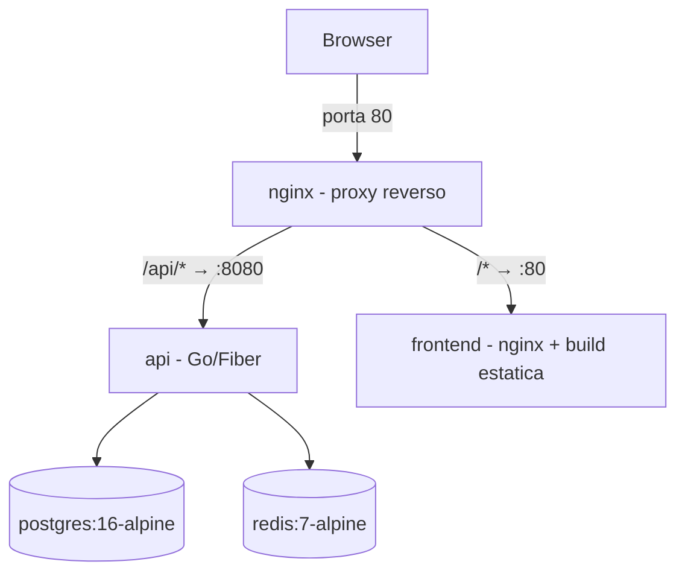

# Infraestrutura

Tudo orquestrado por Docker Compose em `infra/docker-compose.yml`. Cinco serviços:



## Serviços

| Serviço | Imagem | Porta no host | Healthcheck |
|---|---|---|---|
| `nginx` | nginx:1.27-alpine | **80** | — (depende de api healthy) |
| `frontend` | build de `frontend/Dockerfile` | — (interno) | — |
| `api` | build de `backend/Dockerfile` | — (interno :8080) | `wget /health` |
| `postgres` | postgres:16-alpine | **55432** | `pg_isready` |
| `redis` | redis:7-alpine (`--appendonly yes`) | **6379** | `redis-cli ping` |

**Por que 55432?** A porta 5432 do host conflitava com um PostgreSQL nativo do Windows nesta máquina. Dentro da rede Docker a API continua usando `postgres:5432`; a porta do host só importa para ferramentas e testes.

### Cadeia de dependências (healthchecks)

```
postgres healthy ──┐
                   ├──> api inicia ──> api healthy ──> nginx inicia
redis healthy ─────┘                   frontend started ─┘
```

A API se recusa a subir sem Postgres + Redis saudáveis, e o Nginx só sobe com a API healthy (sem isso o Nginx morre com "host not found in upstream"). O Nginx tem `restart: unless-stopped` como segunda linha de defesa.

## Nginx (proxy principal)

Config em `infra/nginx/nginx.conf`:

- `/api/*` → `http://api:8080/*` (o prefixo `/api` é removido no proxy_pass)
- `/*` → `http://frontend:80` (SPA; o nginx do frontend faz fallback para `index.html` — React Router)
- Repassa `X-Real-IP` / `X-Forwarded-For` (usados pelo rate limit de login)
- **Security headers** (plano3): `X-Frame-Options`, `X-Content-Type-Options`, `Referrer-Policy`, `Permissions-Policy` e **CSP** (`default-src 'self'`, `script-src 'self'`, etc.) — aplicados a `/api/` e à SPA

**HTTPS**: o config atual escuta em HTTP puro — aceitável apenas em dev. Em produção: `listen 443 ssl` com certificados, redirect 80→443 e `COOKIE_SECURE=true` na API (sem isso o cookie de refresh viaja em claro).

**CSP e dev local**: os headers acima valem na stack Docker (`http://localhost` via nginx na porta 80). O `npm run dev` do frontend (Vite com HMR) **não** passa por esse nginx — não espere CSP no `:5173`.

## Imagens

### Backend (`backend/Dockerfile`)
- Multi-stage: `golang:1.26-alpine` (build, CGO desabilitado) → `alpine:3.21`
- Roda como usuário **não-root** (`app`, uid 10001)
- Inclui `migrations/` (aplicadas pela API no boot)

### Frontend (`frontend/Dockerfile`)
- Multi-stage: `node:22-alpine` (npm install + build) → `nginx:1.27-alpine` servindo `dist/`
- `nginx.conf` próprio com `try_files ... /index.html` para o React Router

Ambos têm `.dockerignore` (exclui node_modules, dist, testes, binários).

## Variáveis de ambiente

Arquivo `infra/.env` (gitignored; template em `infra/env.example`).

| Variável | Default | Observação |
|---|---|---|
| `JWT_PRIVATE_KEY_PATH` / `JWT_PUBLIC_KEY_PATH` | `/app/keys/*.pem` na imagem Docker | RS256 — chaves geradas no build da imagem |
| `ADMIN_PASSWORD` | **sem default** | Obrigatória — senha do seed do admin |
| `ADMIN_EMAIL` | `admin@local.dev` | |
| `POSTGRES_USER/PASSWORD/DB` | `auth`/`auth_dev_password`/`auth` | Trocar fora de dev |
| `COOKIE_SECURE` | `false` | **`true` em produção** (exige HTTPS) |
| `ACCESS_TOKEN_TTL` | `15m` | |
| `REFRESH_TOKEN_TTL` | `720h` (30d) | |
| `PERMISSIONS_CACHE_TTL` | `5m` | |
| `LOGIN_RATE_LIMIT` / `LOGIN_RATE_WINDOW` | `5` / `15m` | |
| `REDIS_KEY_PREFIX` | `auth:` | Para Redis compartilhado |
| `GEOIP_DB_PATH` | vazio | GeoLite2 `.mmdb` para detecção de viagem impossível |
| `IMPOSSIBLE_TRAVEL_WINDOW_MINUTES` | `30` | Janela em minutos para alerta `impossible_travel` |
| `ARGON2_MEMORY` | `65536` | KiB de memória do Argon2id (opcional) |

## Operação

```bash
cd infra

docker compose up -d --build        # subir tudo
docker compose ps                   # estado + health
docker compose logs api -f          # logs da API (JSON estruturado)
docker compose down                 # parar (volumes preservados)
docker compose down -v              # parar e APAGAR dados (postgres_data, redis_data)
```

Acessos rápidos:

```bash
# Postgres do compose (host)
docker exec -it infra-postgres-1 psql -U auth -d auth

# Redis
docker exec -it infra-redis-1 redis-cli
```

## Explorar o banco com DBeaver

Para ver e editar dados no Postgres (equivalente ao DB Browser no SQLite), use o **[DBeaver Community](https://dbeaver.io/download/)** — gratuito, estável e adequado a longo prazo. Instale no Windows uma vez; a conexão aponta para o container via porta publicada no host.

### Pré-requisito

O Postgres do compose precisa estar rodando:

```bash
cd infra
docker compose up -d postgres
```

### Criar a conexão "Auth Dev"

1. Abra o DBeaver → **Database** → **New Database Connection**
2. Escolha **PostgreSQL** → **Next**
3. Preencha (valores vêm do `infra/.env`):

| Campo | Valor |
|---|---|
| Host | `127.0.0.1` |
| Port | `55432` |
| Database | `auth` (ou `POSTGRES_DB`) |
| Username | `auth` (ou `POSTGRES_USER`) |
| Password | valor de `POSTGRES_PASSWORD` no `.env` |

4. Aba **PostgreSQL**: deixe padrão (não marque SSL em dev local)
5. **Test Connection** → se pedir, baixe os drivers PostgreSQL do DBeaver
6. **Finish** — renomeie a conexão para `Auth Dev` (botão direito → Edit → General)

**Erro comum:** usar porta `5432`. Neste projeto a porta do **host** é `55432` (ver seção de serviços). Dentro do Docker a API usa `postgres:5432`; o DBeaver roda no Windows e precisa da porta mapeada.

### O que fazer no dia a dia

| Tarefa | Onde no DBeaver |
|---|---|
| Ver tabelas e dados | `auth` → **Schemas** → **public** → **Tables** → botão direito → **View Data** |
| Rodar SQL | **SQL Editor** (Ctrl+]) ou botão direito na conexão → **SQL Editor** → **New Script** |
| Ver relacionamentos | Botão direito na tabela → **View Diagram** (ou ER Diagram na conexão) |
| Editar uma linha | **View Data** → duplo clique na célula → **Save** (Ctrl+S) |

Tabelas mais úteis neste projeto:

| Tabela | Conteúdo |
|---|---|
| `users` | Contas, email, `active`, `role_id` |
| `permissions` | Codes (`users.manage`, etc.) |
| `user_permissions` | Quem tem qual permissão |
| `sessions` | Refresh tokens (hash), expiração, revogação |
| `audit_logs` | Trilha de ações críticas (`old_data`/`new_data` em JSONB) |
| `roles` | Papéis organizacionais (não concedem permissão) |

Consultas úteis para colar no SQL Editor:

```sql
-- Usuários com permissões
SELECT u.id, u.name, u.email, u.active, array_agg(p.code ORDER BY p.code) AS permissions
FROM users u
LEFT JOIN user_permissions up ON up.user_id = u.id
LEFT JOIN permissions p ON p.id = up.permission_id
GROUP BY u.id
ORDER BY u.id;

-- Últimos logs de auditoria
SELECT id, action, entity, entity_id, user_id, created_at
FROM audit_logs
ORDER BY created_at DESC
LIMIT 50;
```

### O que **não** fazer no DBeaver

- **Não altere o schema visualmente** (criar/apagar colunas, tabelas) — mudanças de estrutura vão em `backend/migrations/` e são aplicadas pela API no boot. Editar o schema direto no banco gera drift e quebra deploys.
- **Cuidado ao editar** `users.password_hash`, `sessions` e `audit_logs` — são dados sensíveis ou de integridade; prefira a API ou SQL consciente.
- O banco de testes (`auth_test`) é outro database, recriado pelos testes em `127.0.0.1:55432` — não confunda com `auth` de desenvolvimento.

### DBeaver vs terminal

| Situação | Preferir |
|---|---|
| Explorar tabelas, editar poucas linhas, diagramas | DBeaver |
| Script rápido, CI, servidor sem GUI | `docker compose exec postgres psql ...` |

Detalhes do schema (colunas, índices, ER): [database.md](database.md).

## Volumes

| Volume | Conteúdo | Pode perder? |
|---|---|---|
| `postgres_data` | Todos os dados persistentes | **Não** (fonte da verdade) |
| `redis_data` | AOF do cache/contadores | Sim — reconstrói sozinho |
