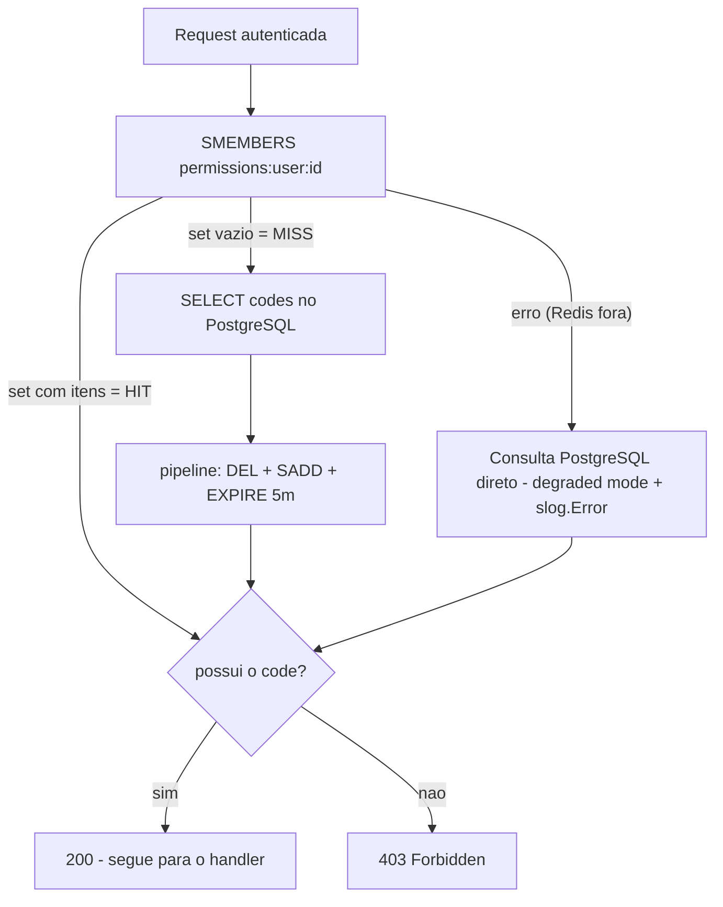
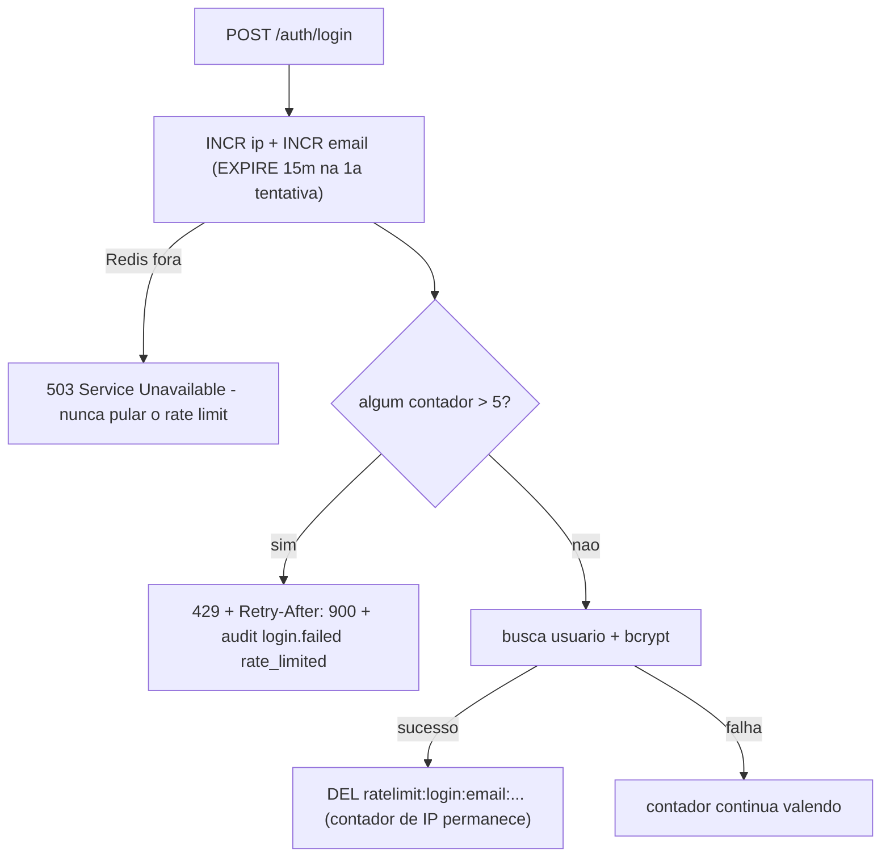

# Redis

Redis 7 cumpre **dois papéis** neste sistema: cache de permissões e rate limiting de login. Nada além disso.

**Regra de ouro**: o Redis pode ser perdido/reiniciado a qualquer momento **sem perda de dados críticos**. Sessões, tokens e permissões vivem no PostgreSQL; o Redis só acelera e protege.

| Dado | Onde fica | Por quê |
|---|---|---|
| Usuários, roles, permissões | PostgreSQL | Persistência, auditoria |
| Sessões / hash do refresh token | PostgreSQL | Revogação durável |
| Audit logs | PostgreSQL | Histórico permanente |
| Cache de permissões | **Redis** | Evita JOIN a cada request autenticada |
| Contadores de tentativa de login | **Redis** | Rate limit compartilhado entre instâncias |

## Como o dado fica no Redis

Todas as chaves recebem o prefixo configurável `REDIS_KEY_PREFIX` (default `auth:`), aplicado pelo wrapper `cache.Client` (`backend/cache/redis.go`).

### 1. Cache de permissões — tipo SET

```
Chave:  auth:permissions:user:{userId}     ex.: auth:permissions:user:123
Tipo:   SET de strings
Valor:  {"users.manage", "permissions.manage", "audit_logs.read"}
TTL:    5 minutos (PERMISSIONS_CACHE_TTL)
```

Inspecionando no container:

```bash
docker exec infra-redis-1 redis-cli SMEMBERS "auth:permissions:user:1"
docker exec infra-redis-1 redis-cli TTL "auth:permissions:user:1"
```

### 2. Rate limit de login — tipo contador (string INT)

```
Chave:  auth:ratelimit:login:ip:{ip}        ex.: auth:ratelimit:login:ip:172.18.0.5
Chave:  auth:ratelimit:login:email:{email}  ex.: auth:ratelimit:login:email:x@y.com
Tipo:   INT (INCR)
Valor:  número de tentativas na janela atual
TTL:    15 minutos (LOGIN_RATE_WINDOW), setado na primeira tentativa
```

## Fluxo 1 — cache de permissões (cache-aside)

Usado pelo middleware `RequirePermission` em toda rota protegida.



Detalhes de implementação (`cache/permissions.go`, `service/permission.go`):

- **Set vazio conta como miss**: usuário sem permissões consulta o Postgres a cada request (trade-off aceito — evita cachear negativo)
- A escrita usa pipeline `DEL → SADD → EXPIRE` para substituição atômica
- Permissões **nunca** entram no JWT — o cache é a única otimização

### Invalidação (DEL imediato)

O cache é invalidado (não esperando o TTL) quando:

| Evento | Onde no código |
|---|---|
| Permissão concedida | `PermissionService.Grant` |
| Permissão revogada | `PermissionService.Revoke` |
| Usuário desativado | `UserService.Update` (junto com revogação de sessões) |

Esquecer a invalidação em um fluxo novo é **bug de segurança** (usuário mantém acesso por até 5 minutos).

## Fluxo 2 — rate limit de login (fixed window)

Roda **antes** do bcrypt — ataques de força bruta não pagam o custo do hash.



- Limite: **5 tentativas / 15 min**, por IP **e** por email (bloqueia se qualquer um estourar)
- Algoritmo: fixed window com `INCR` + `EXPIRE` na primeira tentativa (`cache/ratelimit.go`)
- Login correto limpa só o contador de email; o de IP expira sozinho
- Mesmo a senha correta é bloqueada durante a janela (verificado por teste e2e)

## Comportamento em falha do Redis

| Cenário | Comportamento | Racional |
|---|---|---|
| Redis fora no check de permissão | Fallback para PostgreSQL + `slog.Error` | Disponibilidade: auth continua, só mais lento |
| Redis fora no rate limit do login | **503** | Segurança: não abrir janela de brute force |
| Redis reiniciado | Cache miss geral; contadores zerados | Aceitável — cache se reconstrói sozinho |

Essa assimetria é intencional: no cache de permissões a falha degrada performance; no rate limit a falha degradaria **segurança**.

## Configuração

```
REDIS_URL=redis://redis:6379/0        # db 0 em dev/prod; testes usam db 1
REDIS_KEY_PREFIX=auth:                # testes usam test: e testrl:
PERMISSIONS_CACHE_TTL=5m
LOGIN_RATE_LIMIT=5
LOGIN_RATE_WINDOW=15m
```

No compose, o Redis roda com `--appendonly yes` (persiste em disco entre restarts — conveniente em dev; em produção o cache se reconstruiria de qualquer forma).
